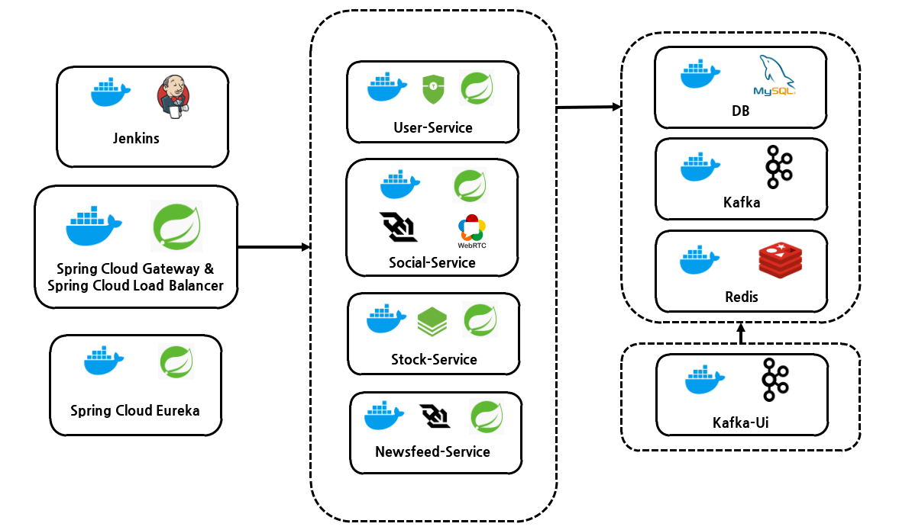
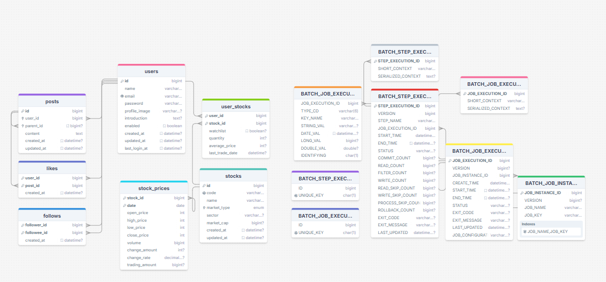

# 📝 주식 토론 게시판 프로젝트

## 📌 프로젝트 소개

<h2 align="center">대규모 커뮤니티와 주식 데이터를 처리하는 통합 백엔드 시스템</h2>

- 이 프로젝트의 목적은 대규모 트래픽을 효율적으로 처리하는 경험을 쌓는 데 있습니다.
- 2024년 8월 7일부터 9월 4일까지 진행한 개인 프로젝트로, 주식 토론 게시판과 관련된 기능을 구현했습니다. 프론트엔드 개발도 병행했습니다.
- 메인 기술 스택으로는 Java 17과 Spring Boot 3.1.5를 사용했으며, 확장성과 유지보수성을 고려하여 마이크로서비스 아키텍처를 적용했습니다.
- 대규모 메시징 처리를 위한 Kafka, 캐싱을 위한 Redis, 서비스 디스커버리를 위한 Eureka, 실시간 통신을 위한 WebSocket, 영상 및 음성 통신을 위한 WebRTC 등 최신 백엔드 기술을 도입했습니다.
- 프론트엔드는 React 18.02와 Node.js 18을 기반으로 구현했습니다.

## 🛠️ 주요 기능

| **Service**         | **Features**                                                                                                 |
|---------------------|-------------------------------------------------------------------------------------------------------------|
| Api Gateway         | Load Balancing, Routing, SSL, CORS                                                                |
| User Service        | 회원 가입, 로그인 (JWT 인증), 로그아웃, 사용자 프로필 관리                                          |
| Stock Service       | 주식 정보 조회 및 관리, 주식 차트 데이터 제공, 기술적 지표 제공(MACD, MA 등..)                      |
| Social Service      | 게시글 작성, 수정, 삭제, 댓글 기능, 좋아요 기능, 팔로우 기능, 게시글 검색, 실시간 채팅(WebSocket), 화상 통화(WebRTC) |
| Newsfeed Service    | 팔로어 좋아요, 게시글 작성 등 커뮤니티 활동 시 알람                                                       |

## 💻 사용된 프레임워크 및 아키텍처

                       

## 🎥 데모 영상 (Demo Video)

- 추후 첨부 예정

## 🏛️ Architecture

## 🗂️ ERD

- 대규모 데이터 처리에서 작업의 안정성을 보장하고 관리하기 위해 Spring Batch를 사용했습니다.
- likes, follows, stock prices 등에 복합 키를 사용하여 데이터 중복을 방지하고 메모리 공간을 절약하였습니다.
