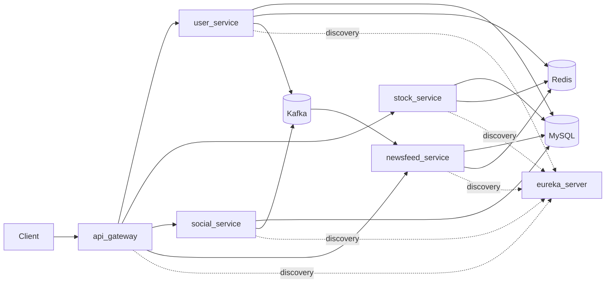

# Stock

[](https://github.com/Acacian/Stock/actions/workflows/ci.yml)


주식 데이터 조회와 커뮤니티 기능을 분리해 설계한 MSA 기반 개인 프로젝트입니다. 인증, 주식 데이터 적재, 소셜 활동, 뉴스피드 생성을 각각 독립 서비스로 나누고 Kafka, Redis, Spring Batch를 이용해 요청 처리와 비동기 후처리를 분리하는 데 초점을 맞췄습니다.

## Quick Start

```bash
docker compose up --build -d
./gradlew clean build
./gradlew integrationTest
```

실행 전 `.env`는 직접 준비해야 합니다.
필수 값: `DB_PASSWORD`, `JWT_SECRET`, `SSL_KEY_STORE_PASSWORD`, `APP_DOMAIN`, `APP_UPLOAD_DIR`, `APP_UPLOAD_URL`

빠르게 확인할 수 있는 주소

- Verification UI: `https://localhost`
- Eureka: `http://localhost:8761`
- Kafka UI: `http://localhost:8080`
- Jenkins: `http://localhost:8082`

## 한눈에 보기

- 기간: 2024.08.07 - 2024.09.07
- 형태: 개인 프로젝트
- 목표: 주식 커뮤니티를 구성하는 인증, 시세 처리, 소셜 이벤트, 뉴스피드 생성을 느슨하게 결합된 서비스로 분리
- 핵심 관심사: 서비스 경계 설계, 이벤트 기반 처리, 캐시 전략, 배치 처리, CI 자동화
- 검증 방식: `test`와 `integrationTest`를 분리하고 GitHub Actions에서 MySQL, Redis, Kafka 연동까지 확인

## 해결하려는 문제

일반적인 CRUD 중심 게시판 구조로는 사용자 인증, 주식 데이터 갱신, 게시글/좋아요/팔로우 이벤트, 뉴스피드 반영이 한 서비스 안에 강하게 결합되기 쉽습니다. 이 프로젝트에서는 아래 문제를 분리해서 다뤘습니다.

- 인증과 사용자 변경 이력이 다른 도메인 로직과 섞이면서 변경 영향 범위가 커지는 문제
- 게시글 작성, 댓글, 좋아요, 팔로우가 뉴스피드 생성 로직과 직접 연결되어 확장성이 떨어지는 문제
- 주식 시세 적재와 기술 지표 계산 같은 주기성 작업이 API 응답 흐름을 방해하는 문제
- Refresh Token, 뉴스피드, 반복 조회 데이터가 DB 부하로 이어지는 문제

## 아키텍처


```mermaid
flowchart LR
    Client[Client] --> Gateway[api_gateway]
    Gateway --> User[user_service]
    Gateway --> Stock[stock_service]
    Gateway --> Social[social_service]
    Gateway --> Newsfeed[newsfeed_service]

    User --> MySQL[(MySQL)]
    Stock --> MySQL
    Social --> MySQL
    Newsfeed --> MySQL

    User --> Redis[(Redis)]
    Stock --> Redis
    Newsfeed --> Redis

    Social --> Kafka[(Kafka)]
    User --> Kafka
    Kafka --> Newsfeed

    Gateway -. discovery .-> Eureka[eureka_server]
    User -. discovery .-> Eureka
    Stock -. discovery .-> Eureka
    Social -. discovery .-> Eureka
    Newsfeed -. discovery .-> Eureka
```


| 서비스 | 역할 |
| --- | --- |
| `api_gateway` | 라우팅, 인증 필터, Rate Limiting, 보안 헤더 처리 |
| `user_service` | 회원가입, JWT 로그인/로그아웃, 이메일 인증, 프로필 관리 |
| `stock_service` | 주식 조회, 가격 적재, 기술적 지표 계산, 배치 작업 |
| `social_service` | 게시글, 댓글, 좋아요, 팔로우, 실시간 소셜 액션 처리 |
| `newsfeed_service` | Kafka 이벤트 기반 뉴스피드 생성과 피드 조회 최적화 |
| `eureka_server` | 서비스 디스커버리 |

## 이벤트 흐름

1. 사용자가 게시글 작성, 댓글, 좋아요, 팔로우 같은 액션을 수행합니다.
2. `social_service`와 `user_service`는 도메인 변경을 처리한 뒤 Kafka 이벤트를 발행합니다.
3. `newsfeed_service`는 해당 이벤트를 구독해 사용자별 피드를 갱신합니다.
4. Redis에는 토큰 상태와 뉴스피드 캐시를 저장해 빠른 조회와 로그아웃 무효화를 처리합니다.
5. `stock_service`는 API 요청과 분리된 배치 흐름에서 주식 데이터와 지표를 적재합니다.

## 저장소 구조

- `api_gateway/`: 외부 진입점, 공통 인증 필터, 프록시 및 보안 설정
- `user_service/`: 사용자 인증, 프로필, 이메일 인증, 이미지 업로드
- `stock_service/`: 주식 조회 API, 배치 처리, 지표 계산
- `social_service/`: 게시글, 댓글, 좋아요, 팔로우
- `newsfeed_service/`: 이벤트 소비, 뉴스피드 적재/조회
- `docker-compose.yml`: 전체 로컬 실행 구성
- `docker-compose.test.yml`: 도커 기반 통합 테스트 구성
- `.github/workflows/ci.yml`: GitHub Actions CI

## 핵심 기능

### 1. 인증과 사용자 관리

- JWT 기반 로그인/로그아웃
- Redis 기반 Refresh Token 저장과 블랙리스트 처리
- 이메일 인증 플로우
- 프로필 조회, 수정, 이미지 업로드

### 2. 주식 데이터 처리

- 주식 정보 조회 및 차트 데이터 제공
- 이동평균선, MACD, RSI, 볼린저 밴드 등 기술적 지표 계산
- Spring Batch 기반 시세 적재 작업

### 3. 소셜 기능

- 게시글 작성, 댓글, 좋아요, 팔로우
- WebSocket 기반 실시간 채팅
- WebRTC 시그널링 컴포넌트 실험

### 4. 뉴스피드 자동화

- 팔로우, 게시글 작성, 댓글, 좋아요 이벤트를 Kafka로 비동기 전파
- 이벤트 수신 후 사용자별 뉴스피드 반영
- Redis 기반 빠른 피드 조회

## 기술 스택

- Backend: Java 17, Spring Boot 3.1.5, Spring Security, Spring Data JPA, Spring Cloud Gateway, OpenFeign, Eureka
- Data: MySQL, Redis
- Messaging: Apache Kafka, Kafka Streams
- Batch and Realtime: Spring Batch, WebSocket, WebRTC
- Frontend: React 18
- Infra: Docker Compose, GitHub Actions, Jenkins

## 기술 선택과 이유

### Kafka

뉴스피드 서비스가 소셜 서비스와 직접 결합되지 않도록 이벤트를 기준으로 분리했습니다. 요청 응답과 후속 처리를 분리해 서비스 책임을 더 명확하게 나눌 수 있었습니다.

### Redis

Refresh Token 저장, 로그아웃 토큰 블랙리스트, 캐시성 조회 데이터에 Redis를 사용했습니다. 만료 시간과 함께 관리해야 하는 데이터가 많아 메모리 기반 저장소가 적합했습니다.

### Spring Batch

주식 데이터 적재와 보조지표 계산은 요청 시점 처리보다 배치 흐름이 더 적합했습니다. API 응답 경로와 주기성 작업 경로를 분리해 역할을 나눴습니다.

### API Gateway + Eureka

게이트웨이를 통해 라우팅과 공통 필터를 모으고, 서비스 탐색은 Eureka로 처리했습니다. 인증, Rate Limiting, 보안 헤더 같은 횡단 관심사를 한 지점에서 관리하려는 의도였습니다.

## 테스트와 CI

### 테스트 전략

- `./gradlew test`: 단위 테스트와 서비스 컨텍스트 로딩 검증
- `./gradlew integrationTest`: MySQL, Redis, Kafka를 사용하는 통합 시나리오 검증
- `docker-compose.test.yml`: 로컬에서 컨테이너 기반 통합 테스트를 재현할 때 사용

### CI 원칙

- GitHub Actions 워크플로에는 애플리케이션 비밀값을 넣지 않았습니다.
- 테스트에 필요한 기본 설정은 각 서비스의 `application-test.yml`에서 관리합니다.
- 워크플로는 MySQL, Redis, Kafka 서비스 컨테이너를 준비하고 `build`와 `integrationTest`를 수행하는 역할만 담당합니다.

워크플로 파일: [`.github/workflows/ci.yml`](./.github/workflows/ci.yml)

## 실행 방법

### 1. 환경 변수 준비

주요 항목

- `DB_PASSWORD`: 로컬 MySQL 비밀번호
- `JWT_SECRET`: JWT 서명용 시크릿
- `SENDING_EMAIL`, `EMAIL_PASSWORD`: 이메일 인증 발송 계정
- `SSL_KEY_STORE_PASSWORD`: API Gateway 인증서 비밀번호

### 2. 로컬 실행

```bash
docker compose up --build -d
```

확인 포인트

- Verification UI: `https://localhost`
- Eureka: `http://localhost:8761`
- Kafka UI: `http://localhost:8080`
- Jenkins: `http://localhost:8082`

간단한 백엔드 검증용 UI는 `api_gateway` 정적 리소스로 포함했습니다. 로그인 토큰 발급, 주식 조회, 게시글 작성, 팔로우, 뉴스피드 조회를 한 화면에서 빠르게 확인할 수 있습니다.

### 3. 테스트 실행

단위 테스트

```bash
./gradlew test
```

통합 테스트

```bash
./gradlew integrationTest
```

도커 기반 통합 테스트

```bash
docker compose -f docker-compose.test.yml up --build integration-test
```

## ERD


- 좋아요, 팔로우, 주식 가격 이력처럼 중복 제어가 중요한 영역은 복합 키를 사용했습니다.
- 배치 처리 대상 데이터는 조회 흐름과 적재 흐름을 고려해 분리했습니다.

## 트러블슈팅

### 로그아웃 이후에도 기존 토큰이 재사용되던 문제

문제

- 서버에서 로그아웃 처리를 끝내도 이미 발급된 JWT가 만료 전까지 유효하게 남아 있었습니다.

해결

- Redis에 블랙리스트 키를 저장하고 TTL을 토큰 만료 시간과 맞췄습니다.
- 인증 필터에서 블랙리스트 조회를 추가해 로그아웃 직후 재사용을 차단했습니다.

## 회고

- 서비스 분리는 단순히 개수를 늘리는 문제가 아니라 변경 이유와 데이터 흐름을 기준으로 경계를 나누는 작업이라는 점을 확인했습니다.
- 프로젝트 규모 대비 지나치게 세분화된 구조는 운영 복잡도를 키울 수 있어, 실제 운영 관점에서는 서비스 책임과 관리 비용의 균형이 중요하다는 점을 배웠습니다.
- 배치, 캐시, 메시징처럼 서로 다른 처리 모델을 한 프로젝트 안에서 함께 다루면서 설계 선택의 trade-off를 더 명확하게 체감했습니다.
