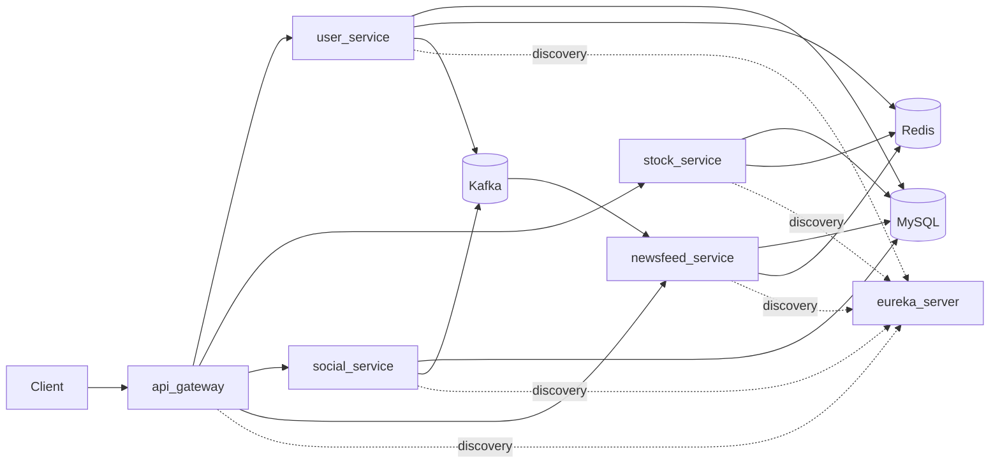

# Stock

[](https://github.com/Acacian/Stock/actions/workflows/ci.yml)


사용자 인증, 소셜 액션, 뉴스피드 반영, 주식 데이터 적재가 서로를 과도하게 침범하지 않도록 분리한 MSA 개인 프로젝트입니다. 단순히 서비스를 나누는 데서 끝내지 않고, 사용자 행동이 어떤 경로로 처리되고 어떤 방식으로 검증되는지까지 추적 가능한 구조를 만드는 데 집중했습니다.

## Quick Start

1. 프로젝트 루트에 `.env` 파일을 만들고 아래 값을 채웁니다.
   `DB_PASSWORD`, `DB_NAME=Stock`, `JWT_SECRET`, `SSL_KEY_STORE_PASSWORD`, `EUREKA_SERVER_URL=http://eureka-server:8761/eureka/`, `REDIS_HOST=redis`, `REDIS_PORT=6379`, `APP_DOMAIN=https://localhost`, `APP_UPLOAD_DIR=/app/uploads/profile_images`, `APP_UPLOAD_URL=https://localhost/uploads`, `SENDING_EMAIL`, `EMAIL_PASSWORD`
2. 애플리케이션을 기동합니다.

```bash
docker compose up --build -d
```

3. 빌드와 테스트를 검증합니다.

```bash
./gradlew clean build
./gradlew integrationTest
```

`.env`는 저장소에 커밋하지 않습니다.

빠르게 확인할 수 있는 주소

- Verification UI: `https://localhost`
- Eureka: `http://localhost:8761`
- Kafka UI: `http://localhost:8080`

## 핵심 요약

- 기간: 2024.08.07 - 2024.09.07
- 형태: 개인 프로젝트
- 목표: 인증, 시세 처리, 소셜 이벤트, 뉴스피드 생성을 느슨하게 결합된 흐름으로 재구성
- 핵심 관심사: 서비스 경계 설계, 이벤트 기반 처리, 캐시 전략, 배치 처리, CI 자동화
- 검증 방식: `clean build`, `integrationTest`, `docker compose up --build -d`, Verification UI까지 실제로 확인

## 이 프로젝트에서 보여주고 싶은 것

- 문제를 나누는 기준: 인증, 소셜, 뉴스피드, 시세 적재를 변경 이유 기준으로 분리했습니다.
- 비동기 처리의 책임: 팔로우, 게시글, 댓글, 좋아요는 Kafka 이벤트로 흘려 뉴스피드 생성과 직접 결합하지 않았습니다.
- 운영 가능한 기본기: GitHub Actions에서 `build`와 `integrationTest`를 분리하고, 로컬 `docker compose` 실행 흐름도 실제로 재현 가능하게 맞췄습니다.
- 검증 습관: README, CI, 테스트 코드, 실제 실행 경로가 서로 어긋나지 않도록 정리했습니다.

## 해결하려는 문제

일반적인 CRUD 중심 게시판 구조로는 사용자 인증, 주식 데이터 갱신, 게시글/좋아요/팔로우 이벤트, 뉴스피드 반영이 한 서비스 안에 강하게 결합되기 쉽습니다. 이 프로젝트에서는 아래 문제를 분리해서 다뤘습니다.

- 인증과 사용자 변경 이력이 다른 도메인 로직과 섞이면서 변경 영향 범위가 커지는 문제
- 게시글 작성, 댓글, 좋아요, 팔로우가 뉴스피드 생성 로직과 직접 연결되어 확장성이 떨어지는 문제
- 주식 시세 적재와 기술 지표 계산 같은 주기성 작업이 API 응답 흐름을 방해하는 문제
- Refresh Token, 뉴스피드, 반복 조회 데이터가 DB 부하로 이어지는 문제
- 문서상 Quick Start는 있어도 실제로는 실행이 막히면 포트폴리오 신뢰도가 떨어지는 문제

## 아키텍처


```mermaid
flowchart LR
    Client[Client] --> Gateway[api_gateway]
    Gateway --> User[user_service]
    Gateway --> Stock[stock_service]
    Gateway --> Social[social_service]
    Gateway --> Newsfeed[newsfeed_service]

    User --> MySQL[(MySQL)]
    Stock --> MySQL
    Social --> MySQL
    Newsfeed --> MySQL

    User --> Redis[(Redis)]
    Stock --> Redis
    Newsfeed --> Redis

    Social --> Kafka[(Kafka)]
    User --> Kafka
    Kafka --> Newsfeed

    Gateway -. discovery .-> Eureka[eureka_server]
    User -. discovery .-> Eureka
    Stock -. discovery .-> Eureka
    Social -. discovery .-> Eureka
    Newsfeed -. discovery .-> Eureka
```


| 서비스 | 역할 |
| --- | --- |
| `api_gateway` | 라우팅, 인증 필터, Rate Limiting, 보안 헤더 처리 |
| `user_service` | 회원가입, JWT 로그인/로그아웃, 이메일 인증, 프로필 관리 |
| `stock_service` | 주식 조회, 가격 적재, 기술적 지표 계산, 배치 작업 |
| `social_service` | 게시글, 댓글, 좋아요, 팔로우, 실시간 소셜 액션 처리 |
| `newsfeed_service` | Kafka 이벤트 기반 뉴스피드 생성과 피드 조회 최적화 |
| `eureka_server` | 서비스 디스커버리 |

## 이벤트 흐름

1. 사용자가 게시글 작성, 댓글, 좋아요, 팔로우 같은 액션을 수행합니다.
2. `social_service`와 `user_service`는 도메인 변경을 처리한 뒤 Kafka 이벤트를 발행합니다.
3. `newsfeed_service`는 해당 이벤트를 구독해 사용자별 피드를 갱신합니다.
4. Redis에는 토큰 상태와 뉴스피드 캐시를 저장해 빠른 조회와 로그아웃 무효화를 처리합니다.
5. `stock_service`는 API 요청과 분리된 배치 흐름에서 주식 데이터와 지표를 적재합니다.

## 저장소 구조

- `api_gateway/`: 외부 진입점, 공통 인증 필터, 프록시 및 보안 설정
- `user_service/`: 사용자 인증, 프로필, 이메일 인증, 이미지 업로드
- `stock_service/`: 주식 조회 API, 배치 처리, 지표 계산
- `social_service/`: 게시글, 댓글, 좋아요, 팔로우
- `newsfeed_service/`: 이벤트 소비, 뉴스피드 적재/조회
- `docker-compose.yml`: 전체 로컬 실행 구성
- `docker-compose.test.yml`: 도커 기반 통합 테스트 구성
- `.github/workflows/ci.yml`: GitHub Actions CI

## 핵심 기능

### 1. 인증과 사용자 관리

- JWT 기반 로그인/로그아웃
- Redis 기반 Refresh Token 저장과 블랙리스트 처리
- 이메일 인증 플로우
- 프로필 조회, 수정, 이미지 업로드

### 2. 주식 데이터 처리

- 주식 정보 조회 및 차트 데이터 제공
- 이동평균선, MACD, RSI, 볼린저 밴드 등 기술적 지표 계산
- Spring Batch 기반 시세 적재 작업

### 3. 소셜 기능

- 게시글 작성, 댓글, 좋아요, 팔로우
- WebSocket 기반 실시간 채팅
- WebRTC 시그널링 컴포넌트 실험

### 4. 뉴스피드 자동화

- 팔로우, 게시글 작성, 댓글, 좋아요 이벤트를 Kafka로 비동기 전파
- 이벤트 수신 후 사용자별 뉴스피드 반영
- Redis 기반 빠른 피드 조회

## 기술 스택

- Backend: Java 17, Spring Boot 3.1.5, Spring Security, Spring Data JPA, Spring Cloud Gateway, OpenFeign, Eureka
- Data: MySQL, Redis
- Messaging: Apache Kafka, Kafka Streams
- Batch and Realtime: Spring Batch, WebSocket, WebRTC
- Frontend: React 18
- Infra: Docker Compose, GitHub Actions, Jenkins

## 기술 선택과 이유

### Kafka

뉴스피드 서비스가 소셜 서비스와 직접 결합되지 않도록 이벤트를 기준으로 분리했습니다. 요청 응답과 후속 처리를 분리해 서비스 책임을 더 명확하게 나눌 수 있었습니다.

### Redis

Refresh Token 저장, 로그아웃 토큰 블랙리스트, 캐시성 조회 데이터에 Redis를 사용했습니다. 만료 시간과 함께 관리해야 하는 데이터가 많아 메모리 기반 저장소가 적합했습니다.

### Spring Batch

주식 데이터 적재와 보조지표 계산은 요청 시점 처리보다 배치 흐름이 더 적합했습니다. API 응답 경로와 주기성 작업 경로를 분리해 역할을 나눴습니다.

### API Gateway + Eureka

게이트웨이를 통해 라우팅과 공통 필터를 모으고, 서비스 탐색은 Eureka로 처리했습니다. 인증, Rate Limiting, 보안 헤더 같은 횡단 관심사를 한 지점에서 관리하려는 의도였습니다.

## 테스트와 CI

### 테스트 전략

- `./gradlew test`: 단위 테스트와 서비스 컨텍스트 로딩 검증
- `./gradlew integrationTest`: MySQL, Redis, Kafka를 사용하는 통합 시나리오 검증
- `docker-compose.test.yml`: 로컬에서 컨테이너 기반 통합 테스트를 재현할 때 사용

### CI 원칙

- GitHub Actions 워크플로에는 애플리케이션 비밀값을 넣지 않았습니다.
- 테스트에 필요한 기본 설정은 각 서비스의 `application-test.yml`에서 관리합니다.
- 워크플로는 MySQL, Redis, Kafka 서비스 컨테이너를 준비하고 `build`와 `integrationTest`를 수행하는 역할만 담당합니다.
- 실제 제출 기준에서는 `clean build`가 깨지지 않는 상태와 로컬 실행 문서가 재현 가능한 상태를 함께 맞췄습니다.

워크플로 파일: [`.github/workflows/ci.yml`](./.github/workflows/ci.yml)

## 실행 방법

### 1. 환경 변수 준비

주요 항목

- `DB_PASSWORD`: 로컬 MySQL 비밀번호
- `DB_NAME`: 기본 DB 이름, 로컬 실행 기준 `Stock`
- `JWT_SECRET`: JWT 서명용 시크릿
- `SENDING_EMAIL`, `EMAIL_PASSWORD`: 이메일 인증 발송 계정
- `SSL_KEY_STORE_PASSWORD`: API Gateway 인증서 비밀번호
- `EUREKA_SERVER_URL`: 로컬 compose 기준 `http://eureka-server:8761/eureka/`
- `REDIS_HOST`, `REDIS_PORT`: 로컬 compose 기준 `redis`, `6379`
- `APP_DOMAIN`: 로컬 compose 기준 `https://localhost`
- `APP_UPLOAD_DIR`: 로컬 compose 기준 `/app/uploads/profile_images`
- `APP_UPLOAD_URL`: 로컬 compose 기준 `https://localhost/uploads`

### 2. 로컬 실행

```bash
docker compose up --build -d
```

확인 포인트

- Verification UI: `https://localhost`
- Eureka: `http://localhost:8761`
- Kafka UI: `http://localhost:8080`

간단한 백엔드 검증용 UI는 `api_gateway` 정적 리소스로 포함했습니다. 로그인 토큰 발급, 주식 조회, 게시글 작성, 팔로우, 뉴스피드 조회를 한 화면에서 빠르게 확인할 수 있습니다.

선택 실행

- Jenkins는 기본 Quick Start에서 제외했습니다.
- 필요하면 `docker compose --profile ops up -d jenkins` 후 `http://localhost:8082`에서 확인할 수 있습니다.

### 3. 테스트 실행

단위 테스트

```bash
./gradlew test
```

통합 테스트

```bash
./gradlew integrationTest
```

도커 기반 통합 테스트

```bash
docker compose -f docker-compose.test.yml up --build integration-test
```

## ERD


- 좋아요, 팔로우, 주식 가격 이력처럼 중복 제어가 중요한 영역은 복합 키를 사용했습니다.
- 배치 처리 대상 데이터는 조회 흐름과 적재 흐름을 고려해 분리했습니다.

## 트러블슈팅

### 로그아웃 이후에도 기존 토큰이 재사용되던 문제

문제

- 서버에서 로그아웃 처리를 끝내도 이미 발급된 JWT가 만료 전까지 유효하게 남아 있었습니다.

해결

- Redis에 블랙리스트 키를 저장하고 TTL을 토큰 만료 시간과 맞췄습니다.
- 인증 필터에서 블랙리스트 조회를 추가해 로그아웃 직후 재사용을 차단했습니다.

### CI `clean build`가 구현 변경을 따라가지 못하던 문제

문제

- `NewsfeedService`, `AuthService` 구현은 바뀌었는데 테스트는 이전 시그니처를 그대로 가정하고 있어 `clean build`가 깨졌습니다.

원인

- `newsfeed_service`는 `List<String>` 기반 검증에서 `List<NewsfeedItem>` 기반 검증으로 바뀌었고, `user_service`는 단일 토큰 문자열이 아니라 access/refresh token 응답 객체를 반환하도록 바뀌었습니다.
- 테스트 코드가 서비스 계약 변경을 따라가지 못하면서 컴파일 단계에서 바로 실패했습니다.

해결

- `newsfeed_service` 테스트를 현재 모델과 직렬화 방식 기준으로 다시 작성했습니다.
- `user_service` 테스트는 Spring Boot 의존을 줄이고 Mockito 기반 단위 테스트로 정리해 반환 타입과 토큰 저장 흐름을 현재 구현에 맞췄습니다.
- 테스트 상태 초기화를 위해 `clearAllNewsfeeds()`를 추가하고, 빈 결과 처리도 방어적으로 정리했습니다.

### Quick Start가 실제로는 한 번에 실행되지 않던 문제

문제

- README에는 `docker compose up --build -d`가 적혀 있었지만 실제로는 이미지, healthcheck, 보조 서비스 때문에 기본 실행이 흔들릴 수 있었습니다.

원인

- 런타임 이미지 베이스로 사용하던 `openjdk:17-jdk-slim` 태그가 더 이상 유효하지 않았습니다.
- 일부 서비스 healthcheck는 실제 노출 엔드포인트와 맞지 않아 컨테이너가 `unhealthy`로 보였습니다.
- Jenkins가 기본 compose에 포함되어 핵심 검증 경로와 무관한 실패가 Quick Start를 흔들 수 있었습니다.

해결

- 런타임 이미지를 `eclipse-temurin:17-jdk-jammy`로 교체했습니다.
- 서비스 healthcheck를 실제 기동 상태와 맞는 방식으로 정리했습니다.
- Jenkins는 `ops` profile로 분리해 기본 Quick Start는 핵심 애플리케이션 검증에만 집중하도록 바꿨습니다.

### CI에 애플리케이션 성격의 값이 섞여 보이던 문제

문제

- 워크플로 파일에 애플리케이션 설정이 직접 들어가 있으면 CI가 테스트 환경 준비를 넘어서 애플리케이션 설정 책임까지 떠안는 구조로 보였습니다.

원인

- 테스트 실행에 필요한 값과 애플리케이션 비밀값의 경계가 분명하지 않았습니다.

해결

- GitHub Actions는 MySQL, Redis, Kafka 준비와 `build`/`integrationTest` 실행만 담당하게 정리했습니다.
- 테스트에 필요한 기본 설정은 각 서비스의 test profile로 이동시켜 워크플로와 애플리케이션 설정 책임을 분리했습니다.

## 회고

- 서비스 분리는 단순히 개수를 늘리는 문제가 아니라 변경 이유와 데이터 흐름을 기준으로 경계를 나누는 작업이라는 점을 확인했습니다.
- 프로젝트 규모 대비 지나치게 세분화된 구조는 운영 복잡도를 키울 수 있어, 실제 운영 관점에서는 서비스 책임과 관리 비용의 균형이 중요하다는 점을 배웠습니다.
- 배치, 캐시, 메시징처럼 서로 다른 처리 모델을 한 프로젝트 안에서 함께 다루면서 설계 선택의 trade-off를 더 명확하게 체감했습니다.
