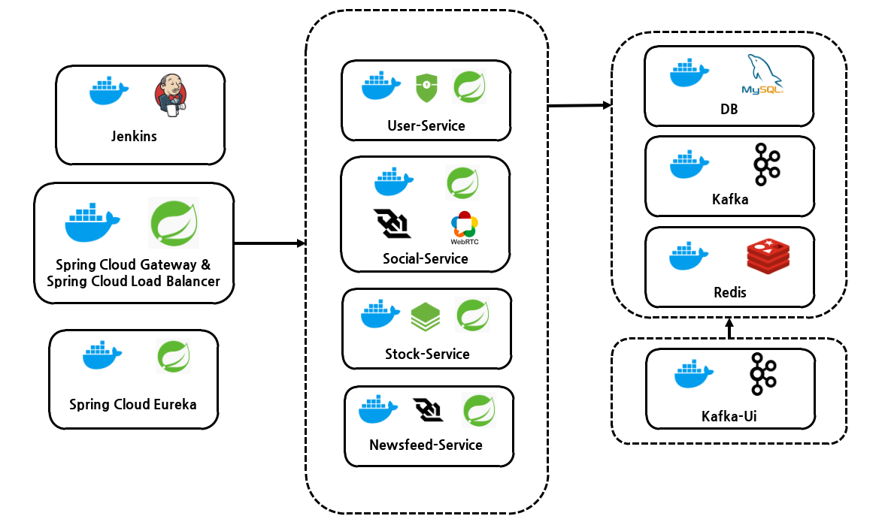
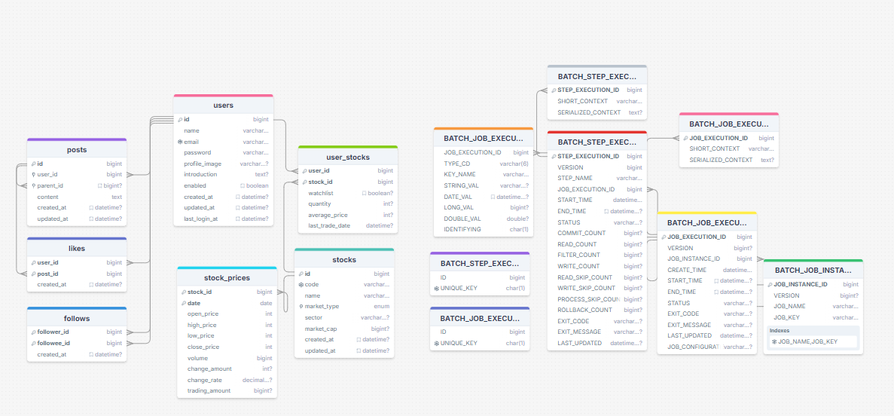

# 📝 주식 토론 게시판 프로젝트

- 이 프로젝트의 목적은 대규모 트래픽을 효율적으로 처리하는 경험을 쌓는 데 있습니다.
- 2024년 8월 7일부터 9월 7일까지 한 달간 진행한 개인 프로젝트로, 주식 토론 게시판과 관련된 기능을 구현했습니다. 프론트엔드 개발도 병행했습니다.
- 메인 기술 스택으로는 Java 17과 Spring Boot 3.1.5를 사용했으며, 확장성과 유지보수성을 고려하여 마이크로서비스 아키텍처를 적용했습니다.
- 대규모 메시징 처리를 위한 Kafka, 캐싱을 위한 Redis, 서비스 디스커버리를 위한 Eureka, 실시간 통신을 위한 WebSocket, 영상 및 음성 통신을 위한 WebRTC 등 최신 백엔드 기술을 도입했습니다.
- 프론트엔드는 React 18.02와 Node.js 18을 기반으로 구현했습니다.

## 🛠️ 주요 기능

| **Service**         | **Features**                                                                                                 |
|---------------------|-------------------------------------------------------------------------------------------------------------|
| Api Gateway         | Load Balancing, Routing, SSL, CORS                                                                |
| User Service        | 회원 가입, 로그인 (JWT 인증), 로그아웃, 사용자 프로필 관리                                          |
| Stock Service       | 주식 정보 조회 및 관리, 주식 차트 데이터 제공, 기술적 지표 제공(MACD, MA 등..)                      |
| Social Service      | 게시글 작성, 수정, 삭제, 댓글 기능, 좋아요 기능, 팔로우 기능, 게시글 검색, 실시간 채팅(WebSocket), 화상 통화(WebRTC) |
| Newsfeed Service    | 팔로어 좋아요, 게시글 작성 등 커뮤니티 활동 시 알람                                                       |

## 💻 사용된 프레임워크 및 아키텍처

                   

## ⚙️ 기술적 의사결정 (성능 향상)

- Docker: 마이크로 서비스를 제대로 구현하기 위해서는 한 서비스의 문제가 전체 서비스에 영향을 미치지 않게 서로 격리되어야 한다고 생각했고, 몇 가지 격리 방법 중 VM보다 가벼운 리소스로 시작할 수 있고 관련 자료가 많은 Docker를 도입해 각 서비스들 간 격리성을 도입하게 되었습니다.
- Kafka: 기존에는 API만을 사용했지만, 동기 방식으로는 대규모 트래픽 처리에 한계가 있다고 판단했습니다. Kafka는 RabbitMQ에 비해 대규모 데이터 스트리밍에 최적화되어 있으며, 높은 처리량을 제공하고 log를 통해 메시지 손실을 방지하는 데 유리해 도입하게 되었습니다.
- Redis: 기존에는 Refresh Token 등 임시 데이터를 유저별로 DB에 저장하고 관리하는 방식이었으나, 이 과정이 비효율적이라고 판단했습니다. 여러 캐싱 기술 중 Redis는 관련 자료가 풍부하고 이전 프로젝트에서도 사용한 경험이 있어, 효율성을 높이기 위해 도입하게 되었습니다.

## 🏛️ Architecture

## 🗂️ ERD

- 대규모 데이터 처리에서 작업의 안정성을 보장하고 관리하기 위해 Spring Batch를 사용했습니다.
- likes, follows, stock prices 등에 복합 키를 사용하여 데이터 중복을 방지하고 메모리 공간을 절약하였습니다.

## TroubleShooting

- 유저가 로그아웃을 했음에도 계속해서 로그인이 되는 현상
: 서버에서는 로그아웃 시 해당 토큰을 만료 처리하도록 조치를 했으나 클라이언트의 인증 토큰을 통해 계속 접근할 수 있어 생긴 문제임을 인지, 이에 대해 토큰의 만료 시간을 더 짧게 하고, Redis를 이용한 Blacklist를 구현 및 TTL을 조정해 일정 시간 내에는 동일한 토큰으로 다시 로그인 할 수 없게 설정해 해결

## ETC

- 대규모 데이터를 처리를 기대했으나, 주식 API의 한계로 Jmeter를 통해 100개 쓰레드풀 생성 및 부하테스트 진행
- 완전한 MSA를 기획하였으나 규모가 적합하지 않다고 판단, DB 등을 통합해 SOA 형태로 최종 결정
